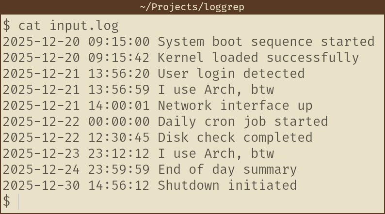
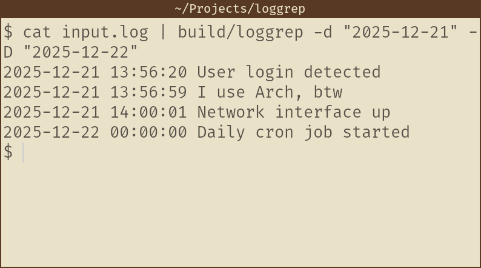
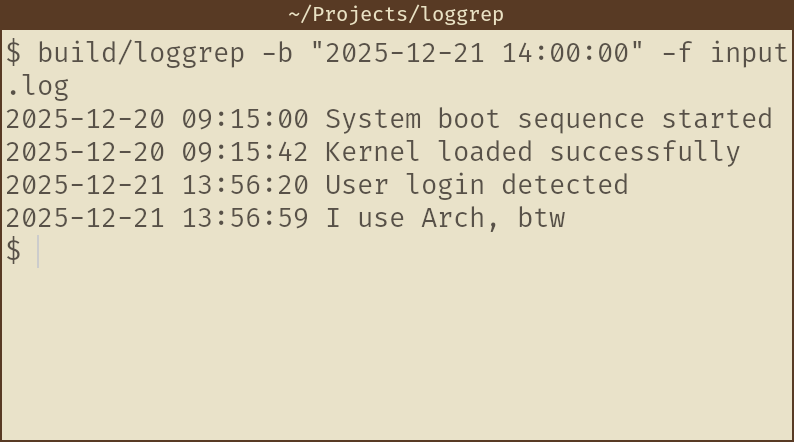
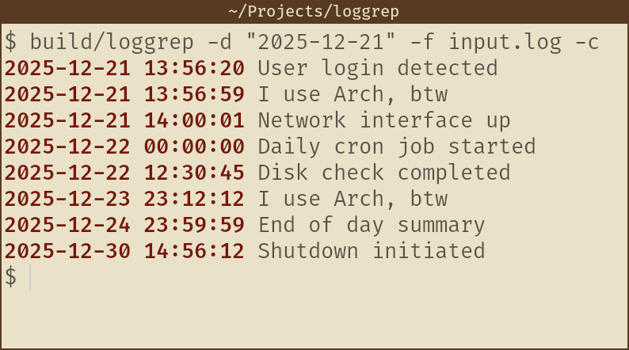
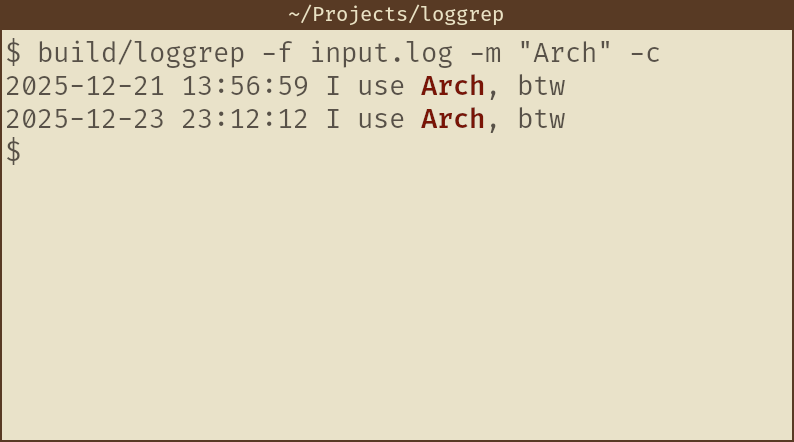

```
 _                                  
| | ___   __ _  __ _ _ __ ___ _ __  
| |/ _ \ / _` |/ _` | '__/ _ \ '_ \ 
| | (_) | (_| | (_| | | |  __/ |_) |
|_|\___/ \__, |\__, |_|  \___| .__/ 
         |___/ |___/         |_|    
```

Simple command line tool for running `grep` on logs.

Performs filtering based on time as well as the log messages.

Features:
* Time-based filtering based on timestamps, dates and hours and minutes.
* Basic substring based message filtering (no regex support).
* Allows reading from input files as well as standard input.
* Allows highlighting parts of log which pass the filters (see below).

# Usage
Run to display logs which were created **after** 12:30A.M. on 1st January 1970 containing the message "foo" from the file "bar.log" and colourise the output.
```sh
loggrep -a "1970-01-01 12:30:00" -m "foo" -f bar.log -c
```

Run for more information:
```sh
loggrep -h
```

Run for version information:
```sh
loggrep -v
```

# Installation
Clone this repository, navigate to it and run make:
```sh
git clone github.com/JaytidaA/loggrep.git --depth 1
cd loggrep
make
```

To clean up the intermediate binaries run:
```sh
make clean
```

To clean everything up (including the final binary) run:
```sh
make clean_all
```

# Examples
* A simple logfile showing the bootup and shutdown of a system:


* Getting all the logs from start of 21st December 2025 to 22nd December 2025:


* Getting all the logs exactly on or before 21st December 2025 2:00P.M.:


* Getting all the logs after start of 21st December 2025 and colourising them:


* Getting all the logs containing the string "Arch" and colourising them:


# Upcoming Features
* More different time-log variants (ISO, journalctl, etc).
* Regular expression support.

# Versioning and License
The current version is `version 0.1.0`. This project and all the source code and images are licensed under the MIT License.
